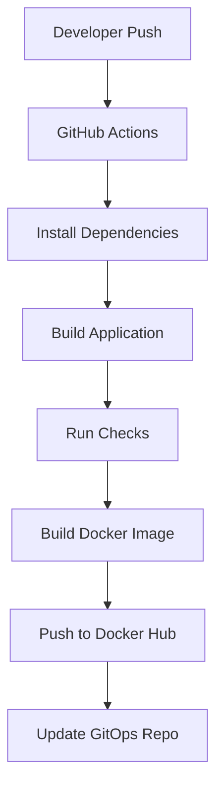

# 🛒 E-Commerce Web App — CI Pipeline

This repository contains the **application code** and **CI pipeline** for an e-commerce web app.

It is designed to simulate a **production-grade CI workflow**, where every commit is automatically built, validated, and prepared for deployment.

---

## 🚀 What This Repo Does

- Builds and validates application code  
- Creates Docker images  
- Pushes images to registry  
- Updates deployment configuration in GitOps repo  

---
⚙️ GitHub Actions Workflow

---

## 🔄 CI Pipeline Flow

Pipeline includes:

- Dependency installation
- Build validation
- Docker image creation
- Image push to Docker Hub
- Tagging using commit SHA

📦 Docker Strategy
- Images are tagged using:  commit-sha

- Ensures immutability
- Avoids stale deployments
- Enables traceability

🔗 Connected CD System
This CI pipeline integrates with:

👉 https://github.com/Sachin8801/gitops-repo

- Updates image tags in values.yaml
- Triggers Argo CD auto-sync

📊 Metrics
| Metric              | Value             |
| ------------------- | ----------------- |
| Build Time          | ~2–4 min          |
| Deployment Trigger  | Fully automated   |
| Rollback Capability | Supported via Git |
| Image Versioning    | SHA-based         |

🧠 Key Learnings
- Small frontend errors can break entire pipelines
- CI must fail fast to prevent bad deployments
- Image tagging strategy is critical for GitOps

🧪 Local Development
1. npm install
2. npm run build

📌 Future Improvements
- Add unit & integration tests
- Introduce security scanning (Trivy)
- Add multi-stage Docker builds
- Improve pipeline parallelization

💡 Philosophy
CI is not just about building code —
it's about ensuring only valid artifacts reach production.
